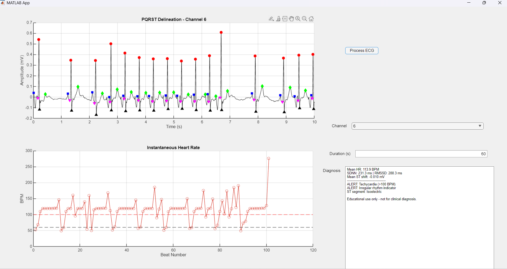
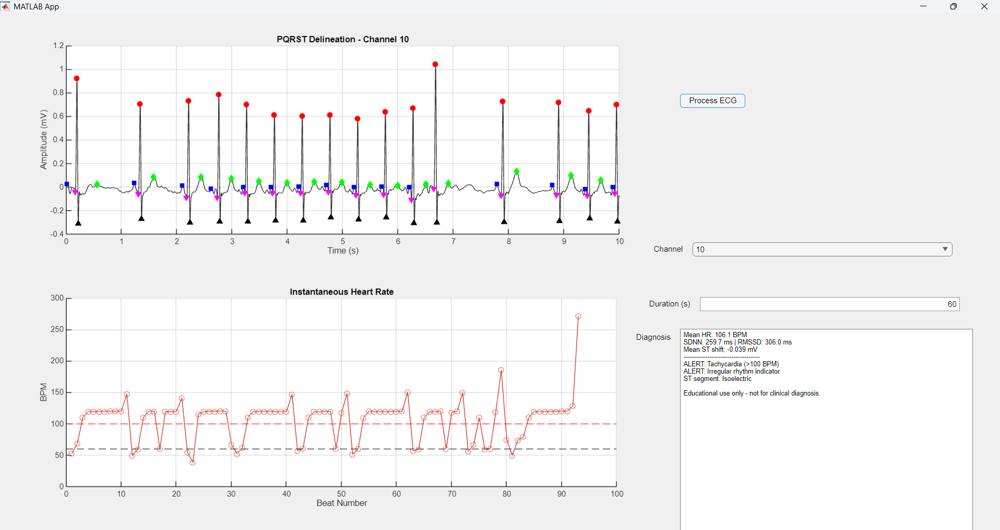

# ECG Signal Analysis in MATLAB

Educational MATLAB project for ECG signal processing and visualization.

## Features

- ECG channel and analysis-duration selection
- Zero-phase band-pass filtering (0.5–40 Hz)
- R-peak detection
- P-Q-R-S-T waveform delineation
- Heart-rate and HRV metrics: SDNN and RMSSD
- Interactive MATLAB App Designer interface
- Console-based analysis and visualizations through `main.m`

## Project structure

- `appecg1.mlapp`: interactive graphical interface
- `main.m`: script-based analysis workflow
- `processECG.m`: reusable ECG processing function

## Requirements

- MATLAB
- Signal Processing Toolbox
- WFDB Toolbox for MATLAB
- A compatible ECG record from PhysioNet, such as `x0010`

## How to run

1. Install the WFDB Toolbox for MATLAB.
2. Download the PhysioNet ECG record and place its files in the project folder.
3. Open and run `appecg1.mlapp`, or run `main.m`.
4. Select a channel and analysis duration.

 ## Application Preview

The application can analyze different ECG channels and display PQRST
delineation, instantaneous heart rate, and an educational summary.

### Channel 6

### Channel 10

## Disclaimer

This is an educational signal-processing project. It is not intended for clinical diagnosis, treatment, or medical decision-making.

## Data source

ECG data obtained from [PhysioNet](https://physionet.org/).
